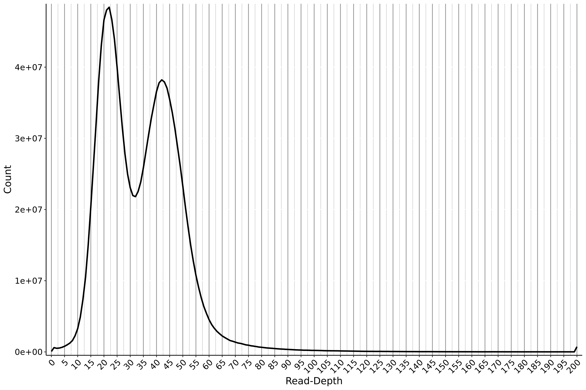
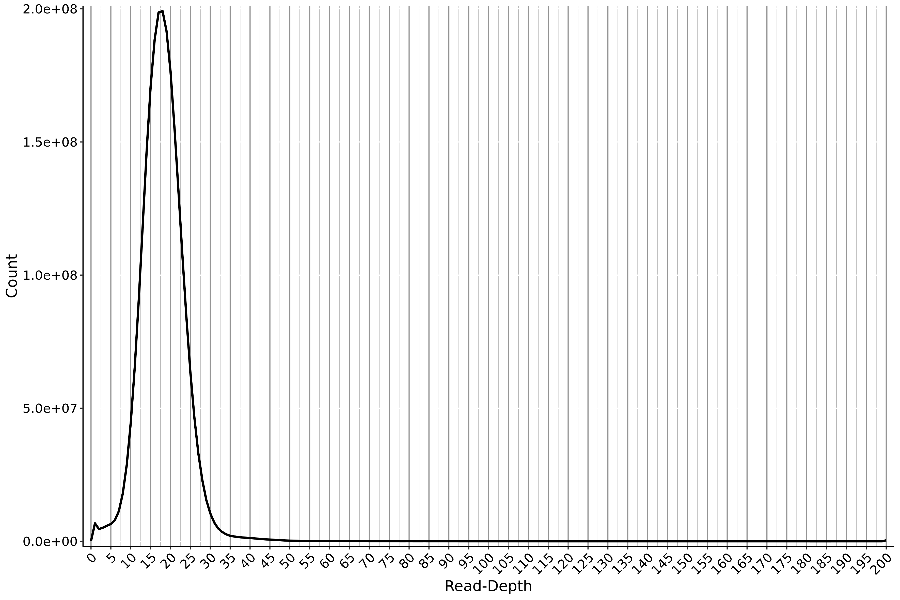
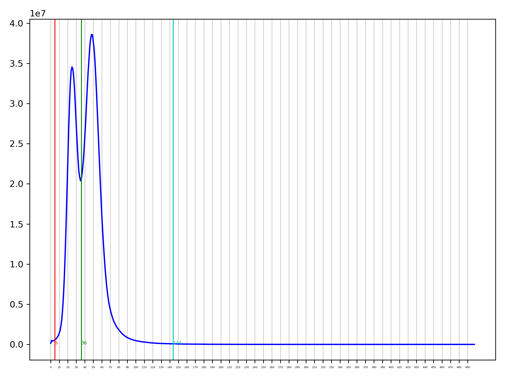
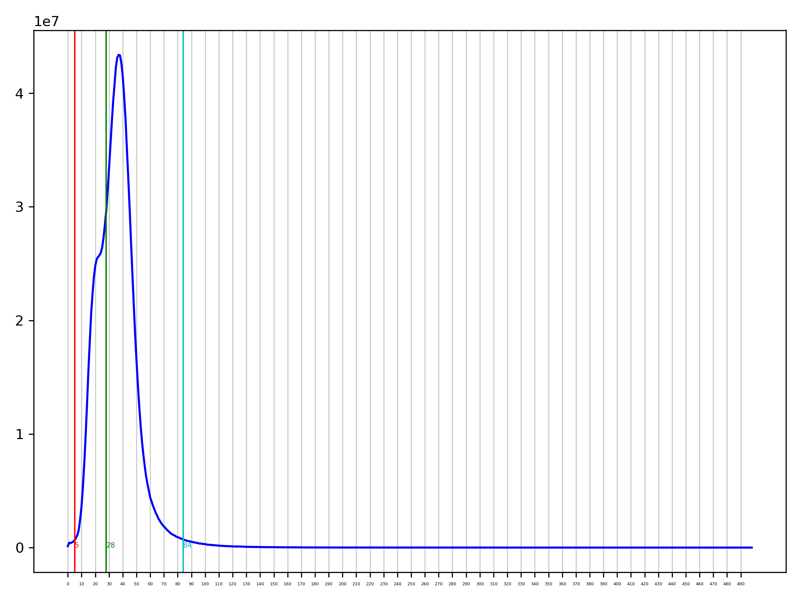

##### Written by Gen Morinaga Jan-2025
# What do I mean by "duplicates"
Duplicated contigs and haplotigs are kind of inevitable in genome assemblies. Here, "duplicates" refer to sequences in a genome assembly that occur more than once as a result of **bioinformatics**, rather any biological processes. This happens because a genome assembler was unable to resolve a heterozygous region, and decided that the sequence should be a part of the main assembly, rather than the alternate.

# Why are duplicates problematic?
Duplicate sequences erroneously inflate the total genome size of genome assemblies. This is probably most evident when comparing genomes output from different assemblers, especially those that do remove (or purge) duplicates (e.g., hifiasm) against those that don't (e.g., Canu). I can show this using genome assemblies of *Aedes aegypti* that I put together:

| Assembler | Genome size (Gbp) | purged?      |
| --------- | ----------------- | ------------ |
| Canu      | 2.38              | no           |
| Flye      | 2.31              | no           |
| hifiasm   | 1.80              | yes, default |
| IPA       | 2.01              | yes, default |
Consider that the reference genome for *[Aedes aegypti](https://www.ncbi.nlm.nih.gov/datasets/genome/GCF_002204515.2/)* is about 1.3 Gbp (yes, it's really that big). This means that all of the assemblies output straight from the genome assemblers are quite a bit bigger than the conspecific reference. This is also clear if you use a gene content completeness metric like BUSCO:


BUSCO genes are genes that should be present in all taxa that belong to a particular clade. In the diptera set (diptera_odb10), there are 3285 genes that should present as single copies (the light blue). Notice that three of the four assemblies output by the genome assemblers have a substantial number of duplicated genes. This means that any kind of gene annotation procedure will erroneously determine multiple copies of any duplicated genes and make it difficult to determine true copy number variation that might be present. 

In short, these genomes in this state are **NOT** accurate representations of the specimen that was sequenced!

# How do I remove duplicates?
I have used two programs to remove or "purge" duplicates from my genome assemblies—[purge_dups](https://github.com/dfguan/purge_dups) and [purge_haplotigs](https://bitbucket.org/mroachawri/purge_haplotigs/src/master/). Both operate using similar principles—mapping the original reads to the assembly and calculating the coverage, and identify duplicate contigs or haplotigs based on an all-against-all alignment. If you want to know more about the nuts and bolts, I suggest reading their respective publications linked on their repositories. The code I show below is for PacBio HiFi, but it should be trivial to adapt it run on other long-read sequences (e.g., CLR or ONT).

I won't make any attempt to suggest one program over the other—both are capable of outputting a nicely purged genome assembly, but their performance is not consistent between assemblers or sets of reads. I think it's best to run both and see which resulting assembly is better.

I have also found that purging an assembly multiple times doesn't help most times. In fact, the only time multiple purging bouts improved the assembly was when I purged a genome that was purged as a part of the assembly process (i.e., an assembly output from hifiasm or IPA).

It's probably worth checking* whether your assembly contains a substantial number of duplicate contigs. Two easy metrics to consider are total length and BUSCO. If the assembly in question is quite a bit larger than the reference or the predicted genome size, then the assembly likely contains lots of duplicates. Similarly, if the BUSCO duplicates score is >15–20%, it is likely worth trying to purge the assembly.

Lastly, before I start adding any code blocks, keep in mind that it's unlikely you'll be able to remove ***all*** duplicates. If you have a BUSCO duplicate score in the single digit percentages and the single-copy percentage in the 90s, you probably have a pretty complete genome and you're unlikely to reduce the number of duplicates beyond this without doing more harm (i.e., over-purging). There are other ways to further reduce the number of BUSCO duplicates (like using the [CSBfilter](https://github.com/genmor/CSBfilter)), but I won't go over them here. 

\*I think it's sensible to get metrics for ALL assemblies that are generated, intermediate or otherwise. This will give you a better sense of what each bioinformatic *touch* is doing to the assembly. It's easy and fast to get contiguity metrics from programs like [BBmap](https://jgi.doe.gov/data-and-tools/software-tools/bbtools/bb-tools-user-guide/bbmap-guide/), and while [BUSCO](https://busco.ezlab.org/) can take some time to run, having this information about an assembly is valuable. Furthermore, the recently introduced [compleasm](https://github.com/huangnengCSU/compleasm) is a faster, more accurate implementation that even outputs the same format files.

## purge_haplotigs
### Installation
I recommend creating a conda environment for purge_haplotigs. You can follow these instructions, which is copied directly from the repository.
```
conda create -n purge_haplotigs -c conda-forge -c bioconda purge_haplotigs
conda activate purge_haplotigs
conda install purge_haplotigs
```

## Running purge_haplotigs
### Step 1. Map the original reads to the assembly
```
asm=/path/to/assembly.fasta
reads=/path/to/reads.fastq.gz
name=some_name
minimap2 -t 20 -ax map-hifi $asm $reads | samtools view -hF 256 - \
| samtools sort -@ 20 -m 4G  -o ${asm%.fa*}_aligned.bam -T ${name}.tmp.ali
```
This first block maps the original reads back onto the assembly using `minimap2`. I specify 20 CPUs using the `-t` flag and also to output a SAM file with cigar-strings using `-a`. The `-x` flag (here simply combined with `-a`) tells `minimap2` to use preset parameters for specified for `map-hifi`, since we have PacBio HiFi reads. The output is piped directly to `samtools view` which converts the SAM to a BAM, this output is piped to `samtools sort`, which will sort the contigs by length.
### Step 2A. Create a coverage histogram for read depth analysis  and choosing cut-off values (easy mode)
```
purge_haplotigs readhist -b ${asm%.fa*}_aligned.bam \
-g ${asm} -t 20
```

This block takes as input `-b` (the bam alignment from **Step 1**), `-g` (the assembly), and `-t` (the number of CPU threads for analysis). It will output a `*.genecov` file (necessary for **Step 3**) and a `png` file showing a read depth histogram of the reads mapped back onto the assembly.

A key step for purging is determining the cut-offs for low, middle, and high read depth. The low and high read depth cut-offs respectively determine which contigs have "unusually" low and high read depths. The middle cut-off delimits the haploid and diploid peaks. For a diploid organism, the histogram generated from this analysis will ideally have two distinct peaks (i.e., be bimodal) like in the following figure:

The first, most obvious peak is the haploid peak and the second peak is the diploid peak. The cut-offs, in effect, determine the beginning and end points of these peaks. When I do this, I try to ask myself "where does the hill start and where does it end?". In the case shown above, the climb up to the haploid peak starts at 4 or 5, while the climb up to the diploid peak starts at 32 (or the climb down from the haploid peak ends at 32). The descent down the diploid peak seems flatten out and end at around 115. These will be the cut-offs for step 3.
### Step 2B. Create a coverage histogram for read depth analysis and choosing cut-off values (hard mode)
There is no guarantee that the read-depth histogram generated using the above script will be bi-modal. This isn't necessarily because you've done something wrong (or something like that). It could be that the assembly hardly has any duplicated contigs. It could also be that the haploid and diploid peaks are very close together. For example:

In this case, we have a single peak, which might suggest that this assembly contains few duplicates. However, recall the BUSCO summary figure that I showed earlier—I generated this read-depth histogram by mapping the reads onto the Canu assembly, which contained the **MOST** duplicates!

When the peaks are ambiguous like this, I try my best to split the single peak using the the middle cut-off. So, for this particular assembly, I would choose a low cut-off of 3, a middle cut-off of 17, and a high cut-off at 65. 

Situations like this can make purging a little difficult, and the repository issues page is full of people asking for help interpreting these read depth figures. If in doubt, I would look through the issues page and find a situation similar to yours and see what the maintainer and other users have suggested.

### Step 3. Using the cut-off values 
```
purge_haplotigs contigcov -i ${asm%.fa*}_aligned.bam.gencov -l 5 -m 31 -h 110
```
This script will use the `*.gencov` and the cut-offs values from **Step 2** to flag contigs that are suspect of being a haplotigs/duplicate. Here, `-l` is the low cut-off, `-m` is the middle cut-off, and `-h` is the high cut-off. Running this script will output a `coverage_stats.csv` file that lists all of the contigs and their respective read coverage and whether or not it's been marked for removal. 

### Step 4. Purge
```
purge_haplotigs purge -b ${asm%.fa*}_aligned.bam -g \
${asm} \
-o ${asm%.fa*}_ph -c coverage_stats.csv -a 60
```
This final step takes as input `-b` (the `bam` from **Step 1**), `-g` (the genome assembly),  `-o` (the output prefix), `-c` (the `coverage_stats.csv` from **Step 3**), and `-a` (the percent identity match threshold). The key flag to pay attention to is  `-a`, as changing it will dictate how aggressive purging will be. `-a` defaults to 70, and lower values indicate more aggressive purging, while higher values indicate the opposite. I would advise against going below 60.

## purge_dups
### Installation
I recommend creating a conda environment for purge_dups and installing the program and its dependencies through bioconda. For example:
```
cd /path/to/conda/envs
conda create -p ./purge_dups -c bioconda purge_dups
conda activate ./purge_dups
conda install bioconda::purge_dups
```

purge_dups can very easily be turned into a pipeline that requires only input configuration and ran from beginning to end. In fact, IPA's internal purging simply runs purge_dups. The author of the program also has an implementation that only requires editing a configuration file. I won't show how to do this, because I don't think it works all that well. What I show is a little more "manual". 
### Step 1. Map reads to draft assembly
```
asm=/path/to/assembly.fasta
reads=/path/to/reads.fastq.gz

for i in $reads;
do
	minimap2 -I6G -t 20 -x map-hifi $asm $i | gzip -c - > $i.paf.gz 
done
```
We align the original Hifi reads to the assembly. Here, `-I` is the number of bases loaded into RAM at once (4G is the default, it can probably stay at 4G); `-t` is the number of CPU threads; and `-x` is the preset mapping mode, which is set here for PacBio Hifi reads. The output from minimap2 will be a `paf` file, which is then compressed using `gzip`.

### Step 2.  Read depth analysis and determining cut-offs
```
pbcstat *.paf.gz
calcuts PB.stat > cutoffs 2>calcults.log 
/path/to/purge_dups/scripts/hist_plot.py -c cutoffs PB.stat PB.cov.png
```
The first line of this block conducts read depth analysis and outputs `PB.stat`, which is fed into the `calcuts` to programmatically determine the cut-off values, which are output in `cutoffs` and whether or not they're adequate are reported in `calcuts.log`. The purge_dups pipeline doesn't produce a histogram as part of its workflow, but the author does include a plotting script, which I use here to output a read depth histogram (`PB.cov.png`). This plotting script takes `-c` the cut-off values generated from `calcuts`, the `PB.stat` file generated from `pbcstat`, and the name of the `png` figure. 

If you inspect the `calcults.log` file, it should say  something like the following:

```
[M::calcuts] Find 2 peaks
[M::calcuts] Merge local peaks and valleys: 2 peaks remain
[M::calcuts] Remove peaks and valleys less than 5: 2 peaks remain
[M::calcuts] Use top 3 frequent read depth
[M::calcuts] Found a valley in the middle of the peaks, use two-peak mode

```

This log simply reporting that it was able to identify a set of low, medium, and high cut-off values that divided the haploid and diploid peaks. We can get a sense of this by looking at the accompanying `PB.cov.png`, which should look like this:

Here, the colored, vertical lines indicate the position of the cut-offs, and they should align with positions where line either starts to climb or finish descending. If this this is the case, you can move on to **Step 3** of purging. However, my experience is that I get a message like this in the `calcults.log` more often than not:

```
[M::calcuts] Find 1 peaks
[M::calcuts] mean: 36, peak: 37, mean not larger than peak, treat as haploid assembly
[W::calcuts] mean is not significantly different with peak, please recheck the cutoffs
```
As the log noted, the cut-offs that `calcuts` found is likely not the best, and  you would be better-served checking them and manually inputting them. We can visually check what the histogram associated with this message looks like:

Looking at this histogram, it's no wonder that the `calcuts` had a hard time setting cut-offs. To set the cut-off values manually run the following:
```
calcuts -l 2 -m 22 -u 130 PB.stat > cutoffs2 2>calcults2.log 
```
This re-runs `calcuts`, but this time with user-specified cut-off values and outputs a new `cutoffs` file. The `caclcults2.log` is not as informative here—it just states that the cut-offs were set manually. You can generate another a histogram figure if you want to visually check again, but I won't do that here.

Once the cut-offs have been determined, we can move on to the purging steps.

### Step 3. Split the assembly, self-align,  and purge 
```
split_fa $pri_asm > $pri_asm.split
minimap2 -xasm5 -DP -t 10 $pri_asm.split $pri_asm.split | gzip -c - > $pri_asm.split.self.paf.gz
purge_dups -2 -T cutoffs2 -c PB.base.cov $pri_asm.split.self.paf.gz > dups.bed 2> purge_dups.log
get_seqs -e dups.bed $pri_asm -p ${pri_asm%.fa*}
```

The final steps of purge_dups uses `split_fa` to split the draft assembly at Ns and creates a self-alignment, again using minimap2. This time, instead of using the `-x map-hifi`, we use `asm5` which is the preset for assemblies with up to 5% sequence divergence. Again, as in **Step 1**, we generate a `paf` and gzip it. The self-alignment is then fed into  `purge_dups` with the flag `-2` (number of chaining rounds [I have no idea what this means]); `-T` the `cutoffs` file generated in **Step 2**; `-c` is the base coverage file `PB.base.cov` created in **Step 2**. This output as `dups.bed`. Lastly `get_seqs` uses the `dups.bed` to output a primary assembly (`-p`) and a haplotigs/duplicates assembly. `-e` tells the program to remove duplicates that are found on the ends of contigs (default). Removing this flag will tell the program to also remove duplicates that occur in the middle of contigs (i.e., break contigs). This is apparently experimental, and when I tried it, my assemblies were over-purged. Your milage may vary.